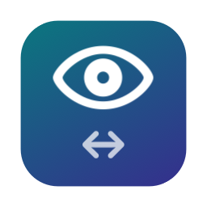

<p align="center"></p>

# Headway

**Keyboard focus that follows your head.** A free, open-source menu-bar app for macOS.

With two or more screens, you look at one, start typing — and the keystrokes land in the window you last used on the *other* screen, because focus stayed behind. Headway fixes that. It uses the webcam to tell which screen you're facing and moves keyboard focus there. On a single screen it can also focus the window, or the split pane in your terminal or editor, that you're looking at.

> **Early preview.** Focus switching, pane detection and the decision logic are tested; the head tracking has so far only been tried on one setup. Expect to tune the settings. Issues and reports of how it behaves on your desk are very welcome.

## What it does

- **Follows you between screens.** Turn to a screen and focus moves to the window you last used there (and, optionally, the pointer comes along).
- **Doesn't twitch.** Quick glances are ignored (300 ms by default); there's a dead band at the gap between screens so looking at the bezel doesn't ping-pong; looking down at your phone or desk changes nothing.
- **Never fights you.** While you use the mouse or trackpad, and for 1.5 s after, nothing moves. While you type, a quick glance elsewhere never steals your keystrokes: another window or screen takes over only after you've looked at it for about a second, and split panes inside one app stay put until you stop typing. Clicking somewhere yourself cancels anything pending.
- **Windows and panes on the same screen.** Look at another window (or another editor group / terminal split in Cursor, VS Code, Xcode, iTerm2…) and it gets focus. Browsers, chat and document apps are always treated as whole windows.
- **Gets better as you work.** You look where you click, so each click fine-tunes the model to how you actually sit.
- **Easy on the battery.** About 17–19% of one CPU core while tracking on an M4 MacBook Air (half the camera's frames, a third once you're still), and the camera turns off after 5 minutes without keyboard or mouse. Switch it on or off with **Power Saving** in the menu-bar eye, or each part separately in Settings.
- **Private.** Video is analysed in memory with Apple's Vision framework (720p, at most 15 frames a second) and discarded immediately. Nothing is recorded, uploaded or tracked. No accounts, no network access.

## Requirements

- macOS 14 Sonoma or later, Apple silicon or Intel
- A camera that faces you (the built-in one is fine)
- Two or more screens for screen switching (one screen works for window/pane focus)

## Install

**Download:** a ready-to-run app will be on the [Releases](../../releases) page soon. It isn't notarized by Apple, so the first time macOS will say it can't verify the developer: click **Done**, then open **System Settings › Privacy & Security** and click **Open Anyway** next to Headway.

**Build from source** (Xcode 15.3 or later):

```sh
git clone https://github.com/IrakliDNL/headway.git
cd headway
scripts/build.sh        # builds, installs to ~/Applications/Headway.app and launches it
```

The script signs with your own "Apple Development" certificate if you have one (Xcode › Settings › Accounts gives you one for free), so macOS remembers Headway's permissions across rebuilds. Without one it signs ad-hoc, which works, but you'll need to re-allow Camera and Accessibility after each rebuild.

## Setup

The setup window walks you through it:

1. **Camera** — allow it.
2. **Accessibility** — switch Headway on in *System Settings › Privacy & Security › Accessibility*. This is how Headway moves focus between windows without clicking.
3. **Calibrate** — a dot visits nine spots on each screen, about 20 seconds per screen. Follow it the way you'd naturally look at things there, from your usual working position.
4. Turn to a screen and type.

Recalibrate from the menu-bar eye whenever you move your screens or your chair a lot; Headway suggests it when it keeps getting the screen wrong.

## Checking it works

Turn on **Show Gaze Dot** in the menu-bar eye: a dot shows where Headway thinks you're looking and an outline shows the window or pane it picked. Green = following you, orange = holding back (you're typing or using the mouse), grey = you're looking away.

| Try | Expected |
|---|---|
| Type on one screen, turn to the other and wait | Focus moves to the window you last used there within about a second |
| Glance at the other screen for a split second | Nothing changes |
| Keep typing while looking at the other screen or another window | Focus follows only after about a second — a quick glance changes nothing |
| Use the mouse, then turn | Nothing moves until 1.5 s after the mouse stops |
| Look down at your phone | Nothing changes; the menu-bar eye dims |
| Look at the gap between the screens | No flip-flopping |
| Two windows side by side; look from one to the other without typing | The one you look at gets focus after about 0.3 s |
| Editor + terminal split in Cursor or VS Code; look at the other one | That pane gets the cursor |
| ⇧⌘G | Pauses (the eye gets a slash); again to resume |
| Lock the Mac | The camera light turns off; it comes back after you unlock |

## Settings

Menu-bar eye › **Settings…**: switch delay, turn threshold (50% = the gap between your screens), same-screen window/pane focus and its delay, hold focus while typing and for how long, bring the pointer along, learn from clicks, click fallback for panes, power saving (fewer frames analysed; camera off when you're away), camera, gaze dot, pause shortcut (⇧⌘G, ⌃⌥⌘G or none — note ⇧⌘G is also Finder's *Go to Folder*), open at login.

**Cursor / VS Code users:** to see split panes Headway switches on the app's accessibility tree. The app may then offer "Screen Reader Optimized" mode — choose *No*, or set `"editor.accessibilitySupport": "off"` in its settings.

## How it works

- **Camera → numbers** ([`Camera.swift`](Sources/Headway/Camera.swift)): Apple Vision gives head yaw/pitch and face landmarks; Headway derives where the nose sits within the face (head turn), where the pupils sit within the eyes (eye direction), and the face's position and size (posture, distance). Only these numbers are kept.
- **Which screen** ([`GazeModel.swift`](Sources/HeadwayCore/GazeModel.swift)): the calibration samples form one cloud per screen. A linear discriminant finds the combination of measurements that best separates the screens, and progress along it runs from 0 (this screen's centre) to 1 (the other screen's centre), stretched so that 50% falls on the gap between the screens even when they're different sizes. Poses far from every screen are ignored.
- **Where on the screen:** a regression per screen maps head and eye measurements to a point, refitted after every click. Aim within a screen is the hard part for a webcam: on a 13" MacBook screen, calibration alone lands a median ~300 pt from where you actually click, falling to ~100 pt once it has learned from a few dozen clicks — enough to tell side-by-side windows apart, not small buttons.
- **When to move** ([`FocusEngine.swift`](Sources/HeadwayCore/FocusEngine.swift)): reacts to *changes* in where you face or look, after the delay; never during mouse use; while typing only after a longer look, and never between panes of the same app.
- **Moving focus** ([`Windows.swift`](Sources/Headway/Windows.swift), [`Panes.swift`](Sources/Headway/Panes.swift)): macOS Accessibility, plus the window-server call that window switchers such as AltTab use to bring a specific window forward. Panes are focused through their text input; see [`docs/pane-research.md`](docs/pane-research.md).

The decision logic lives in a separate `HeadwayCore` module with no camera or UI code, and is covered by tests.

## Files and uninstalling

- `~/Library/Application Support/Headway/learned.json` — calibration and learned clicks (head-pose numbers only)
- `~/Library/Logs/Headway/headway.log` — what Headway did and why (no face data)

To uninstall: quit Headway, delete `~/Applications/Headway.app` and the two folders above, then run
`defaults delete com.irakli.headway; tccutil reset Camera com.irakli.headway; tccutil reset Accessibility com.irakli.headway`.

## Development

```sh
swift test                                   # decision-logic tests
swift build && .build/debug/Headway --windows     # screens and windows as Headway sees them
.build/debug/Headway --focus-test            # bounce focus between screens and verify (needs Accessibility for your terminal)
.build/debug/Headway --panes                 # pane scan of every open window, with timings
.build/debug/Headway --evaluate              # how well the saved calibration aims, measured against your own clicks
.build/debug/Headway --experiment            # compare aim-model variants against your clicks
open ~/Applications/Headway.app --args --diagnose 10   # log 10 s of face numbers + CPU per stage to ~/Library/Logs/Headway/
open -n --env HEADWAY_EVERY_NTH=3 ~/Applications/Headway.app --args --diagnose 10   # same, analysing every 3rd frame
defaults write com.irakli.headway debugReadings -bool YES   # per-frame readings → ~/Library/Logs/Headway/readings.jsonl
scripts/release.sh                           # universal, ad-hoc-signed zip for the Releases page
```

Headway uses two private macOS functions (`_AXUIElementGetWindow` and SkyLight's front-process call, both looked up defensively), which is why it will never be on the Mac App Store.

## Acknowledgements

Inspired by [Glance Switch](https://glanceswitch.com), a polished paid app by an independent developer — if you'd rather have something supported, buy it. Headway is an independent open-source implementation and isn't affiliated with Glance Switch.

## License

[MIT](LICENSE)
